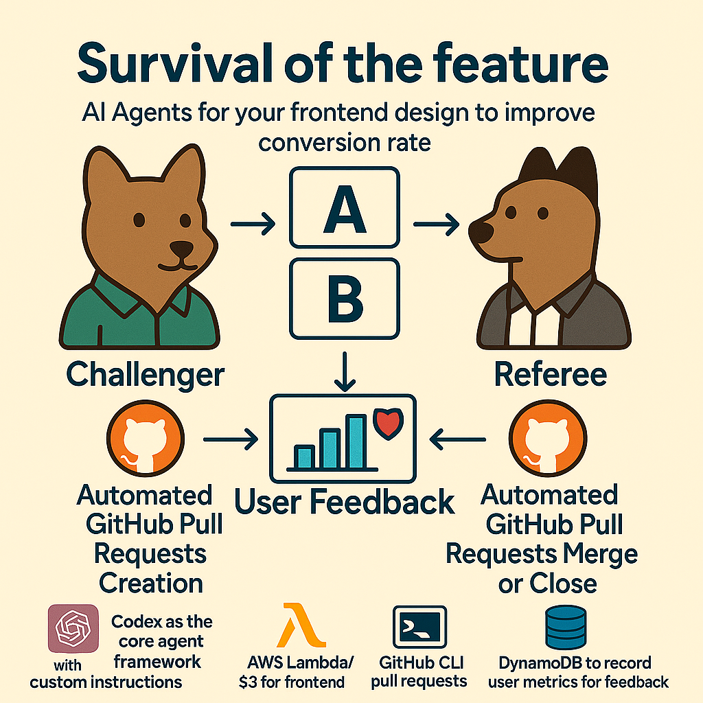

# Survival of the Feature




This project hosts three variants of a static web page (`main`, `variant-1`, `variant-2`) on Amazon S3 and tracks user scroll-depth for A/B testing or feature experiments via a serverless backend.


## What We Built

1. **Static S3 Website Variants**
   - Three Git branches (`main`, `variant-1`, `variant-2`) each have an `index.html` with slight variations.
   - `deploy_variants_aws_cli.sh` creates/updates an S3 bucket, enables website hosting, applies a public-read policy, and uploads:
     - The branch’s `index.html` (with an injected `<script src="scroll-tracker.js"></script>`)
     - The `scroll-tracker.js` artifact alongside.
   - After running, each variant is live at:
     ```
     http://your-bucket.s3-website-<region>.amazonaws.com/main/
     http://your-bucket.s3-website-<region>.amazonaws.com/variant-1/
     http://your-bucket.s3-website-<region>.amazonaws.com/variant-2/
     ```

2. **Random Redirect + QR**
   - `deploy_qr_redirect.sh` generates a small HTML redirect page that randomly forwards visitors to one of the three variants.
   - It uploads this to `/redirect/index.html` on S3 and produces a `random-redirect-qr.png` which can be scanned to trigger the random A/B test.

3. **Serverless Scroll-Depth Tracking**
   - **Back-end**: Deployed via AWS SAM (`template.yaml`) as:
     - **DynamoDB Table** (`scroll-events-<stack>`) storing `{ sessionId, ts, variant, maxDepth, ttl }`.
     - **Lambda Function** (`ScrollTrackerFunction-<stack>`) subscribed to `POST /track` on API Gateway.
   - **Scripts**:
     - `deploy_scroll_tracking.sh`: packages & deploys the SAM stack (requires `DEPLOY_S3_BUCKET` in `.env`).
   - `test_scroll_tracking.sh`: invokes the Lambda directly (with logs) and via the API endpoint to verify data ingestion.
   - **Read events** endpoint `GET /events`: fetches all stored scroll events, optionally filterable by `?variant=` query param.

4. **Client Instrumentation**
   - `scroll-tracker.js` is injected into each `index.html`.
   - It computes the maximum scroll percentage on each page load and sends it via `navigator.sendBeacon` to the `/track` API when the page is hidden or unloaded.
   - Variant detection is done by parsing the URL path (`/main/`, `/variant-1/`, `/variant-2/`).

## Getting Started
6. (Optional) Query captured events:
   ```bash
   # Fetch all events
   curl https://<YOUR_EVENTS_API_URL>
   # Fetch only main variant events
   curl https://<YOUR_EVENTS_API_URL>?variant=main
   ```

1. Copy your AWS credentials and configuration into `.env`:
   ```ini
   AWS_ACCESS_KEY_ID=...
   AWS_SECRET_ACCESS_KEY=...
   AWS_REGION=us-west-1
   AWS_ACCOUNT_ID=123456789012
   DEPLOY_S3_BUCKET=your-cfn-package-bucket
   ```

2. Deploy the scroll-tracking back-end:
   ```bash
   chmod +x deploy_scroll_tracking.sh
   ./deploy_scroll_tracking.sh
   ```

3. Upload static variants to S3:
   ```bash
   chmod +x deploy_variants_aws_cli.sh
   ./deploy_variants_aws_cli.sh
   ```

4. Generate a random-redirect QR code:
   ```bash
   chmod +x deploy_qr_redirect.sh
   ./deploy_qr_redirect.sh
   ```

5. Test scroll-tracking end-to-end:
   ```bash
   chmod +x test_scroll_tracking.sh
   ./test_scroll_tracking.sh
   ```

Now open one of your variant URLs in a browser, scroll around, and verify the scroll event shows up in DynamoDB (or via logs in `test_scroll_tracking.sh`).

---
_Happy experimenting!_ 🚀

## Docker Environment

You can run all of the project’s scripts and tools inside a Docker container.

1. Build the Docker image:
   ```bash
   docker build -t survival-of-the-feature .
   ```

2. Start an interactive shell (loads your `.env`):
   ```bash
   docker run --rm -it \
     --env-file .env \
     -v "$(pwd)":/app \
     survival-of-the-feature
   ```

Inside the container you can run:
```bash
./deploy_scroll_tracking.sh
./deploy_variants_aws_cli.sh
./deploy_qr_redirect.sh
./test_scroll_tracking.sh
./run_agent.sh
```

Alternatively, with Docker Compose:
```bash
docker-compose up -d --build
docker-compose exec app bash
```

## Automated Feature Experimentation Agents

This project includes two automated agents to streamline the feature experimentation workflow:

### Agent A: Variation Generator
Agent A generates new variations of the static web page (`index.html`) and creates pull requests for review.

- See `instruction_a.md` for details.
- To run Agent A:
  ```bash
  chmod +x run_agent_a.sh
  ./run_agent_a.sh
  ```

Agent A workflow:
1. Generates a modified `index.html` variant.
2. Uses `create_pr.sh` to open a pull request against the `main` branch.

### Agent B: Variation Evaluator
Agent B evaluates open pull requests by fetching scroll-depth metrics and deciding which variants to merge or close.

- See `instruction_b.md` for details.
- To run Agent B:
  ```bash
  chmod +x run_agent_b.sh
  ./run_agent_b.sh
  ```

Agent B workflow:
1. Fetches open PRs via `gh pr list`.
2. Retrieves metrics for each variant using `fetch_pr_events.sh`.
3. Merges or closes PRs based on engagement data.

## License

This project is licensed under the MIT License. See the [LICENSE](LICENSE) file for details.